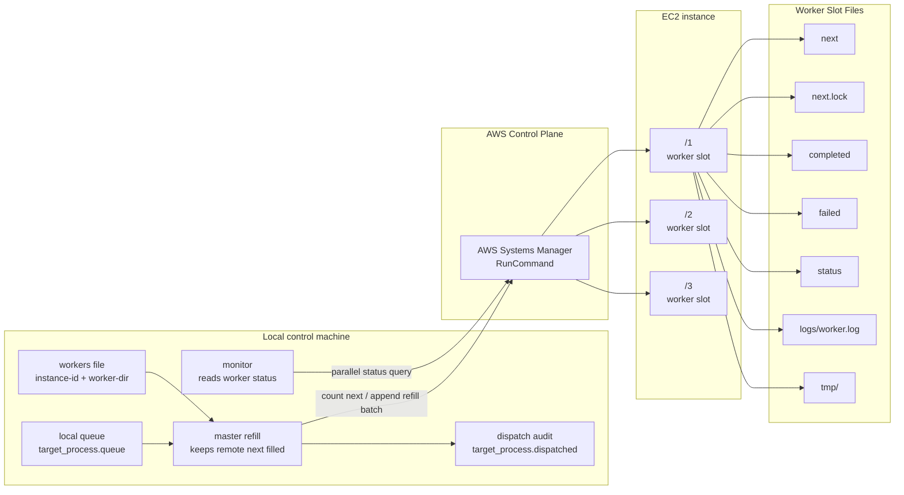
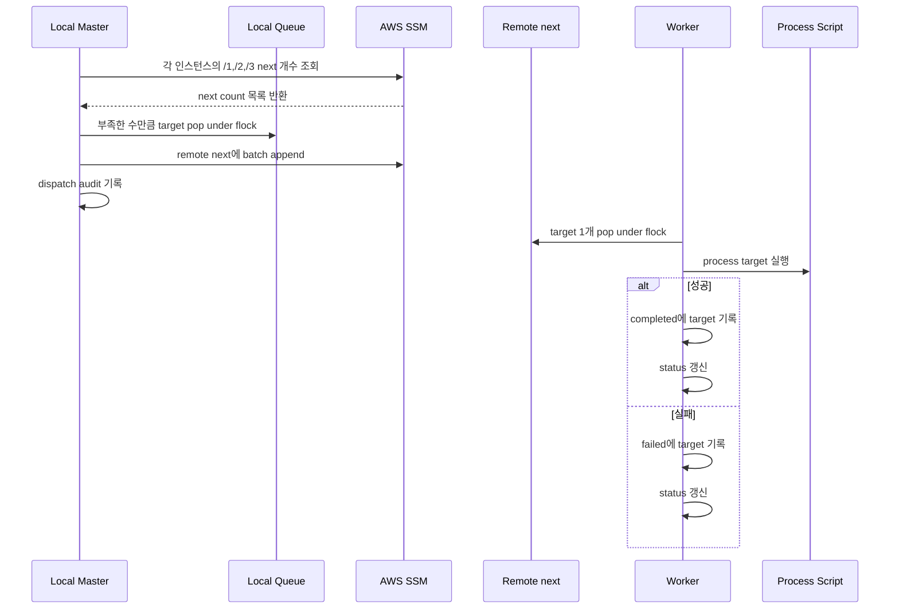

# EC2 Master/Worker Process Queue

이 문서는 대량의 독립 작업을 EC2 여러 대에 분산해서 실행하는 master/worker 큐 구조를 설명한다. 특정 업무 도메인이나 처리 내용은 중요하지 않다. 핵심은 “매우 많은 process target을 로컬 큐에 넣고, EC2 worker slot에 균등하게 분배해서, 병렬로 처리하고, 진행 상황을 회수/모니터링하는 방법”이다.

예를들어 s3에 있는 수많은 파일을 EC2 worker 여러 대에서 병렬로 처리하는 상황을 상상해보자. 이 문서에서 설명하는 구조는 이런 유형의 작업에 적합하다.

Local에서 전체 target 목록을 관리하는 master가 있고, 다른 리전의 여러 EC2 인스턴스에 worker slot을 만들어서 master가 local queue에서 target을 pop해서 각 slot의 remote next에 채워준다. 각 worker는 자기 slot의 next에서 하나씩 pop해서 처리한다. worker는 성공/실패를 slot별 파일에 남긴다. monitor는 SSM으로 모든 slot의 상태를 주기적으로 읽어서 진행 상황을 보여준다.

이를 통해 EC2의 네트워크, 디스크 I/O, CPU 같은 리소스를 최대한으로 사용하면서 실시간으로 진행 상황을 모니터링할 수 있고, EC2와 EBS 증가만으로 동시 처리량을 쉽게 늘릴 수 있다.

이 문서는 사람이 읽고 이해하고 쓰기보단 AI에게 제공하고 필요한 준비작업을 AI가 수행하며, 사람은 오직 모니터링 스크립트만 실행해 실행상태 체킹만 하는데 사용하기 위함이다.

이 문서에서 사용하는 용어는 다음과 같다.

| 용어 | 의미 |
| --- | --- |
| process target | 처리할 작업 1개를 나타내는 문자열. 보통 URI, key, id 같은 한 줄짜리 값이다. |
| local queue | 아직 EC2에 dispatch되지 않은 target 목록 파일. |
| master | 로컬에서 실행되는 큐 refill 프로세스. |
| worker slot | EC2 내부의 독립 작업 디렉토리. 예: `/1`, `/2`, `/3`. |
| worker | worker slot 하나를 담당하는 장기 실행 프로세스. |
| remote next | 각 worker slot에 있는 대기 큐 파일. |
| status | worker slot의 현재 진행 상태를 나타내는 한 줄짜리 파일. |

## 반드시 챙길 것

이 구조는 단순하지만, 아래 항목을 놓치면 target 중복 처리, target 유실, 잘못된 인스턴스 종료, 실패 원인 추적 불가 같은 문제가 생긴다. AI가 이 문서를 보고 작업을 수행할 때는 이 섹션을 먼저 확인해야 한다.

### Queue Lock

- local queue에서 target을 pop할 때는 반드시 `flock "$QUEUE_FILE.lock"`을 사용한다.
- remote `next`에서 worker가 target을 pop할 때는 반드시 slot별 `next.lock`을 사용한다.
- master가 remote `next`에 append할 때도 반드시 해당 slot의 `next.lock`을 잡는다.
- lock 없이 `head`, `tail`, `mv`, `cat >> next`를 수행하면 master refill, worker pop, 재분배가 겹칠 때 target이 중복되거나 사라질 수 있다.

### Atomic Write

- `next`를 수정할 때는 임시 파일에 쓴 뒤 `mv`로 교체한다.
- `status` 갱신은 반드시 고유 임시 파일에 쓴 뒤 `mv -f`로 교체한다.
- `status.$$`처럼 PID 기반 고정 파일명을 쓰면 background monitor와 main process가 동시에 status를 쓸 때 race가 날 수 있다.
- 권장 형태:

```bash
tmp="$(mktemp "${status_file}.XXXXXX")"
printf "%s\n" "$(date -Is) phase=running target=$target" > "$tmp"
mv -f "$tmp" "$status_file"
```

### Target Record

- queue record 하나는 반드시 한 줄이어야 한다.
- TSV/NDJSON을 써도 literal newline은 넣지 않는다.
- shell에서 target record는 항상 quote한다.
- target record에 민감한 값이 들어가면 `logs`, `status`, `ps`, `pgrep -af` 출력에 노출될 수 있으므로 넣지 않는 것을 원칙으로 한다.

### Dispatch Audit

- master가 local queue에서 target을 pop하고 remote `next` append에 성공했으면 `target_process.dispatched`에 기록한다.
- remote append 실패 시 pop했던 target은 local queue 앞으로 되돌린다.
- `dispatched`는 “완료”가 아니라 “EC2에 넘김” 기록이다. 완료 여부는 remote `completed`와 output/result 검증으로 판단한다.

### Worker Slot Isolation

- 한 worker process는 하나의 `REMOTE_DIR`만 소유한다.
- 같은 slot에 worker process를 중복 실행하지 않는다.
- EC2 한 대에 여러 worker를 둘 때는 `/1`, `/2`, `/3`처럼 디렉토리를 분리한다.
- 각 slot은 자기 `next`, `completed`, `failed`, `status`, `tmp`, `logs`만 사용해야 한다.

### Process Result Validation

- process script가 결과물을 만든다면 다음 단계로 commit/publish/write 하기 전에 결과물이 실제로 존재하고 0 byte가 아닌지 확인한다.
- 외부 명령으로 결과물을 만들면 stdout/stderr를 임시 로그에 남긴다.
- 실패 시 worker log에 원인이 남아야 나중에 재시도 여부를 판단할 수 있다.
- process script는 이미 처리된 target을 만나면 skip하고 성공 처리할 수 있게 만드는 것이 좋다.

### Monitor Semantics

- `NEXT`는 아직 실행에 들어가지 않은 remote 대기 target 수다.
- 현재 실행 중인 target은 `NEXT`에 포함되지 않는다.
- `CPU`, `RX/s`, `TX/s`는 slot별 값이 아니라 인스턴스 단위 값이다. 같은 EC2의 여러 slot 행에 동일하게 반복 표시된다.
- `completed`와 `failed`는 slot별 누적 파일이다.
- 실패 target을 재시도해서 성공해도 기존 `failed` 줄 수는 자동으로 줄지 않는다.
- 재시도 성공 여부는 output/result 존재 여부, retry 후 `completed` 기록, 또는 별도 검증으로 확인한다.

### Instance Termination

- EC2 종료 조건은 “해당 인스턴스의 모든 slot이 `NEXT=0`이고 `phase=idle`”일 때다.
- 일부 slot만 idle이면 종료하면 안 된다.
- `status`가 오래된 `uploading`, `committing`, `running` 상태라면 실제 프로세스 확인이나 output/result 확인 없이 종료하지 않는다.
- 종료 전 필요한 경우 remote `next`와 현재 target을 회수한다.
- 종료 후에는 `process-workers.instances`와 `workers`에서 해당 instance-id를 제거한다.

### Rebalance

- local queue가 비었는데 일부 EC2에 heavy target의 remote `next`가 몰릴 수 있다.
- 재분배는 현재 실행 중인 target이 아니라 아직 실행 전인 remote `next`만 대상으로 한다.
- 재분배 전 master를 중단한다.
- 모든 remote `next`를 `flock`으로 drain하고, idle slot에 round-robin으로 append한다.
- drain/assignment 결과는 파일로 남긴다.

### Security

- secret은 queue record, status, logs, command line에 넣지 않는다.
- process에 secret이 필요하면 SSM Parameter Store, IAM Role, instance metadata 같은 별도 경로로 주입한다.
- `ps`, `pgrep -af`, worker log가 command line 인자를 노출할 수 있음을 고려한다.

## 권장 파일 구성

유사한 작업을 새로 구성할 때는 아래와 같은 역할 기반 이름을 사용하는 것을 권장한다. 핵심은 파일명 자체가 아니라 역할 분리다.

| 역할 | 권장 파일 |
| --- | --- |
| process 실행 스크립트 | `scripts/process-target.sh` |
| worker loop | `scripts/process-worker.sh` |
| master refill | `scripts/process-master-refill.sh` |
| worker monitor | `monitor-process-workers.sh` |
| EC2 bootstrap user-data | `scripts/ec2-bootstrap-process-workers.sh` |
| 인스턴스 목록 | `process-workers.instances` |
| worker slot 목록 | `workers` |
| local queue | `target_process.queue` |
| dispatch audit log | `target_process.dispatched` |

기존 구현을 재사용할 때 파일명이 다르다면, 이 문서의 `process-*` 이름을 실제 파일명에 맞춰 치환해서 사용하면 된다.

## 전체 구조



## 기본 아이디어

작업은 두 단계 큐로 관리한다.

1. 로컬 master가 큰 전체 큐를 가진다.
2. master는 각 EC2 worker slot의 `next` 파일을 작게 채워준다.
3. 각 worker는 자기 slot의 `next`에서 하나씩 pop해서 처리한다.
4. worker는 성공/실패를 `completed`, `failed`에 남긴다.
5. monitor는 SSM을 통해 모든 slot의 `status`를 읽는다.

이 구조의 장점:

- SSH 없이 SSM만으로 배포/실행/모니터링할 수 있다.
- EC2 한 대에 여러 worker slot을 둘 수 있다.
- master를 중단해도 이미 remote `next`에 들어간 작업은 계속 진행된다.
- worker별 `next`가 작기 때문에 특정 인스턴스를 종료할 때 회수해야 할 범위가 제한된다.
- local queue pop과 remote next pop은 모두 `flock`으로 보호한다.

## 큐 계층

### Local Queue

예시 파일:

```text
target_process.queue
```

현재 구현 파일:

```text
target_process.queue
```

형식:

```text
target-1
target-2
target-3
```

특징:

- 한 줄이 process target 하나다.
- master만 이 파일에서 pop한다.
- 병렬 master refill 과정에서 동시에 접근할 수 있으므로 `target_process.queue.lock` 형태의 lock 파일을 사용한다.
- dispatch에 성공한 target은 audit log에 남는다.

### Remote Next Queue

각 EC2 worker slot에는 `next` 파일이 있다.

```text
/1/next
/2/next
/3/next
```

특징:

- 한 줄이 process target 하나다.
- worker가 하나씩 pop한다.
- pop은 `next.lock`으로 보호한다.
- master는 각 `next` 파일의 줄 수가 `MAX_NEXT`보다 작으면 부족분만 append한다.

## Worker Slot 디렉토리

한 EC2 인스턴스에 여러 worker slot을 둘 수 있다. 현재 구조는 인스턴스당 3개 slot을 사용한다.

```text
/1
/2
/3
```

각 slot의 구성:

```text
next
next.lock
completed
failed
status
logs/worker.log
tmp/
worker script
process script
```

slot은 서로 독립적이다. 같은 EC2 안에서도 `/1`, `/2`, `/3` worker가 동시에 실행된다.

## 처리 흐름



## Master Refill 동작

master는 로컬에서 실행된다.

역할:

- `workers` 파일을 읽는다.
- 같은 instance-id에 속한 worker dirs를 그룹화한다.
- 각 인스턴스에 SSM command를 한 번 보내 `/1`, `/2`, `/3`의 `next` 줄 수를 조회한다.
- 여러 인스턴스 조회/리필을 병렬로 실행한다.
- 부족한 수만큼 local queue에서 pop한다.
- pop한 target을 remote next에 append한다.
- dispatch audit log를 기록한다.
- 실패 시 pop했던 target을 local queue 앞으로 되돌린다.

주요 환경변수:

| 변수 | 기본값 | 설명 |
| --- | --- | --- |
| `WORKERS_FILE` | empty | worker slot 목록 파일. 보통 `workers`. |
| `INSTANCES_FILE` | `process-workers.instances` | instance-id 목록 파일. `WORKERS_FILE`이 없을 때 사용. |
| `QUEUE_FILE` | `target_process.queue` | local queue 파일. |
| `DISPATCHED_FILE` | `target_process.dispatched` | dispatch audit log. |
| `MAX_NEXT` | `5` | worker slot별 remote next를 최대 몇 개까지 채울지. |
| `REFILL_PARALLELISM` | `20` | master가 동시에 처리할 인스턴스 수. |
| `INTERVAL_SECONDS` | `30` | refill pass 사이의 대기 시간. |
| `ONCE` | `0` | `1`이면 한 번만 refill하고 종료. |

foreground 실행:

```bash
WORKERS_FILE=workers \
QUEUE_FILE=target_process.queue \
MAX_NEXT=5 \
REFILL_PARALLELISM=10 \
INTERVAL_SECONDS=10 \
scripts/process-master-refill.sh
```

중단:

```text
Ctrl-C
```

master를 중단해도 remote next에 이미 들어간 target은 worker가 계속 처리한다.

한 번만 refill:

```bash
ONCE=1 \
WORKERS_FILE=workers \
QUEUE_FILE=target_process.queue \
MAX_NEXT=5 \
REFILL_PARALLELISM=10 \
scripts/process-master-refill.sh
```

## Worker 동작

worker는 EC2의 특정 slot 디렉토리에서 계속 실행된다.

동작 순서:

1. `REMOTE_DIR`로 이동한다.
2. 필요한 디렉토리와 파일을 만든다.
3. process 실행에 필요한 runtime secret/config를 읽어 환경변수로 준비한다.
4. 무한 루프를 돈다.
5. `next`에서 target 하나를 `flock`으로 pop한다.
6. process script를 실행한다.
7. 성공하면 `completed`에 기록한다.
8. 실패하면 `failed`에 기록한다.
9. 대기 target이 없으면 `status`에 `phase=idle`을 쓰고 sleep한다.

slot별 로그:

```text
/N/logs/worker.log
```

slot별 상태:

```text
/N/status
```

예시 status:

```text
2026-04-28T06:49:04+00:00 phase=running pct=54% bytes=32979288064 total=60108212049 target=...
```

## Process Script 규약

process script는 target 하나를 받아 처리하는 단일 작업 실행기다.

권장 규약:

- 인자는 target 하나만 받는다.
- 성공 시 exit code `0`.
- 실패 시 non-zero.
- 진행 상황을 `PROCESS_STATUS_FILE` 같은 status file 환경변수로 주기적으로 기록한다.
- status file 갱신은 반드시 원자적으로 한다. 고정된 임시 파일명은 쓰지 말고 `mktemp "${PROCESS_STATUS_FILE}.XXXXXX"` 같은 고유 임시 파일에 쓴 뒤 `mv -f`로 교체한다.
- 임시 파일은 slot의 `tmp/` 하위에 만든다.
- 작업 종료 시 가능한 한 임시 파일을 정리한다.
- 이미 처리된 target이라면 skip하고 성공 처리할 수 있어야 한다.
- process 결과를 다음 단계로 commit/publish/write 하기 전에 결과물이 실제로 존재하고 0 byte가 아닌지 확인한다.
- 외부 명령을 실행해 결과 파일을 만드는 경우, stdout/stderr를 slot의 임시 로그 파일에 남기고 실패 시 worker log로 노출되게 한다.
- process 내부에서 background monitor를 같이 돌릴 경우, monitor와 main process가 같은 status file을 동시에 갱신할 수 있으므로 status write helper가 concurrent-safe해야 한다.

현재 구현에서는 process script가 다음 식으로 worker에서 호출된다.

```bash
PROCESS_STATUS_FILE="${REMOTE_DIR}/status" ./process-script.sh "$target"
```

현재 파일명은 다음과 같다.

```bash
PROCESS_STATUS_FILE="${REMOTE_DIR}/status" ./process-target.sh "$target"
```

새로운 작업으로 재사용할 때는 이 script만 교체하면 master/worker queue 구조는 그대로 사용할 수 있다.

## EC2 구성

현재 사용한 예시:

```text
instance type: c8i.large
root volume: gp3
size: 1000 GiB
IOPS: 3000
throughput: 500 MB/s
worker slots per instance: 3
```

대량 파일 I/O 또는 큰 임시 파일을 다루는 process라면 gp3 기본 throughput은 병목이 될 수 있다. `iostat`로 확인하면서 throughput을 조정한다.

인스턴스 생성 예시:

```bash
aws ec2 run-instances \
  --region us-east-1 \
  --image-id "$AMI_ID" \
  --instance-type c8i.large \
  --count 10 \
  --subnet-id "$SUBNET_ID" \
  --security-group-ids "$SG_ID" \
  --iam-instance-profile Name="$PROFILE" \
  --user-data file://scripts/ec2-bootstrap-process-workers.sh \
  --block-device-mappings '[{"DeviceName":"/dev/xvda","Ebs":{"VolumeSize":1000,"VolumeType":"gp3","Iops":3000,"Throughput":500,"Encrypted":true,"DeleteOnTermination":true}}]' \
  --tag-specifications \
    'ResourceType=instance,Tags=[{Key=Name,Value=process-workers},{Key=Project,Value=process-queue}]' \
    'ResourceType=volume,Tags=[{Key=Name,Value=process-workers},{Key=Project,Value=process-queue}]' \
  --query 'Instances[].InstanceId' \
  --output text
```

## 인스턴스 목록과 Worker Slot 목록

`process-workers.instances`는 instance-id만 담는다.

```text
i-aaaaaaaaaaaaaaaaa
i-bbbbbbbbbbbbbbbbb
```

`workers`는 instance-id와 slot dir을 담는다.

```text
i-aaaaaaaaaaaaaaaaa /1
i-aaaaaaaaaaaaaaaaa /2
i-aaaaaaaaaaaaaaaaa /3
i-bbbbbbbbbbbbbbbbb /1
i-bbbbbbbbbbbbbbbbb /2
i-bbbbbbbbbbbbbbbbb /3
```

생성 명령:

```bash
: > workers
while read -r id; do
  printf '%s /1\n%s /2\n%s /3\n' "$id" "$id" "$id" >> workers
done < process-workers.instances
```

## Worker 배포

process script와 worker script를 임시 위치에 올린 뒤 SSM으로 각 EC2에 배포한다.

```bash
aws s3 cp scripts/process-target.sh \
  s3://YOUR_BUCKET/_tmp/process-workers/process-target.sh \
  --region us-east-1 \
  --only-show-errors

aws s3 cp scripts/process-worker.sh \
  s3://YOUR_BUCKET/_tmp/process-workers/process-worker.sh \
  --region us-east-1 \
  --only-show-errors
```

배포 및 실행:

```bash
aws ssm send-command \
  --region us-east-1 \
  --instance-ids $(tr '\n' ' ' < process-workers.instances) \
  --document-name AWS-RunShellScript \
  --comment deploy-start-process-workers \
  --parameters commands='[
    "set -euo pipefail",
    "for d in /1 /2 /3; do mkdir -p \"$d/logs\" \"$d/tmp\"; aws s3 cp s3://YOUR_BUCKET/_tmp/process-workers/process-target.sh \"$d/process-target.sh\" --region us-east-1 --only-show-errors; aws s3 cp s3://YOUR_BUCKET/_tmp/process-workers/process-worker.sh \"$d/process-worker.sh\" --region us-east-1 --only-show-errors; chmod +x \"$d/process-target.sh\" \"$d/process-worker.sh\"; touch \"$d/next\" \"$d/completed\" \"$d/failed\"; done",
    "for d in /1 /2 /3; do if ! pgrep -af \"REMOTE_DIR=$d .*process-worker.sh\" >/dev/null; then nohup bash -lc \"REMOTE_DIR=$d AWS_REGION=us-east-1 $d/process-worker.sh\" >> \"$d/logs/worker.log\" 2>&1 & fi; done",
    "sleep 2",
    "pgrep -af process-worker.sh | wc -l"
  ]' \
  --query 'Command.CommandId' \
  --output text
```

주의:

- local에 있는 파일명과 EC2에 배포되는 파일명은 worker script 내부 호출명과 일치해야 한다.
- 범용화하려면 worker script 내부의 process script 파일명도 같이 변경한다.

## 모니터링

```bash
watch -n 5 'WORKERS_FILE=workers ./monitor-process-workers.sh'
```

monitor는 다음 방식으로 동작한다.

- `workers`를 instance-id 기준으로 그룹화한다.
- 인스턴스마다 SSM command 1개를 보낸다.
- 여러 인스턴스는 병렬로 조회한다.
- 각 slot의 `next`, `completed`, `failed`, `status`를 출력한다.
- 인스턴스 단위 `CPU`, `RX/s`, `TX/s`를 함께 출력한다.
- 리소스 지표는 SSM command 내부에서 약 1초 샘플링하므로 monitor 실행 시간이 1초 정도 늘어난다.

출력 예시:

```text
INSTANCE               DIR          NEXT  COMPLETED   FAILED     CPU       RX/s       TX/s  STATUS
i-xxx                  /1              2        100        0   82.4%  120.0MB/s   40.0MB/s  2026-04-28T06:49:04+00:00 phase=running pct=54% target=...
i-xxx                  /2              0        103        1   82.4%  120.0MB/s   40.0MB/s  2026-04-28T06:49:03+00:00 phase=idle next=0

TOTAL next=20 completed=1676 failed=5
```

`NEXT`는 아직 실행에 들어가지 않은 remote 대기 target 수다. 현재 실행 중인 target은 `NEXT`에 포함되지 않는다.

`CPU`, `RX/s`, `TX/s`는 같은 인스턴스의 모든 slot 행에 동일하게 표시된다.

## 상태 Phase

process script가 어떤 phase를 기록할지는 작업마다 다르다. 권장 phase는 다음과 같다.

| phase | 의미 |
| --- | --- |
| `idle` | worker가 대기 중이다. |
| `preparing` | process 실행 준비 중이다. |
| `running` | 실제 process 실행 중이다. |
| `committing` | 결과를 최종 위치나 다음 단계로 반영하는 중이다. |
| `done` | 성공 완료. |
| `skipped` | 이미 처리된 target이라 건너뜀. |
| `failed` | 실패. |

현재 process script가 더 구체적인 phase를 출력해도 monitor는 그대로 문자열로 보여준다.

## 로그와 파일

로컬:

```text
target_process.queue
target_process.queue.lock
target_process.dispatched
target_process.dispatched.lock
logs/master.log          # background 실행 시 선택
```

remote slot:

```text
/N/next
/N/next.lock
/N/completed
/N/failed
/N/status
/N/logs/worker.log
/N/tmp/
```

dispatch audit log 형식:

```text
timestamp instance-id remote-dir target
```

## 중단과 복구

### Master 중단

foreground 실행 중이면:

```text
Ctrl-C
```

master를 멈춰도 remote `next`에 들어간 작업과 현재 실행 중인 worker는 계속 진행된다.

### Worker 강제 중단

인스턴스를 종료하거나 작업 구조를 바꿀 때는 먼저 remote에 남은 작업을 회수하는 것이 안전하다.

worker 프로세스 중단 예시:

```bash
aws ssm send-command \
  --region us-east-1 \
  --instance-ids INSTANCE_ID \
  --document-name AWS-RunShellScript \
  --comment stop-process-workers \
  --parameters commands='[
    "set -euo pipefail",
    "pkill -f process-target.sh || true",
    "pkill -f process-worker.sh || true"
  ]' \
  --query 'Command.CommandId' \
  --output text
```

process command line에 민감한 값이 포함될 수 있으므로, 운영 중 `pgrep -af`, `ps aux` 출력은 주의한다.

### Remote Next 회수

아직 실행에 들어가지 않은 target은 각 slot의 `next`에 있다. 인스턴스를 종료하기 전에 이 파일을 읽어 local queue로 되돌린다.

수집 예시:

```bash
aws ssm send-command \
  --region us-east-1 \
  --instance-ids INSTANCE_ID \
  --document-name AWS-RunShellScript \
  --comment collect-worker-queues \
  --parameters commands='[
    "set -euo pipefail",
    "for d in /1 /2 /3; do echo \"###DIR $d\"; sed \"s/^/NEXT /\" \"$d/next\" 2>/dev/null || true; done"
  ]' \
  --query 'Command.CommandId' \
  --output text
```

회수한 target을 `recovered-inflight` 같은 파일로 저장한 뒤 local queue 앞에 중복 없이 붙인다.

```bash
cp target_process.queue "target_process.queue.bak.$(date +%Y%m%d%H%M%S)"

awk 'NR==FNR { if (!seen[$0]++) print; next } { if (!seen[$0]++) print }' \
  recovered-inflight \
  target_process.queue \
  > target_process.queue.new

mv target_process.queue.new target_process.queue
```

### Remote Next 재분배

작업 후반에는 무거운 target이 특정 EC2나 특정 slot에 몰릴 수 있다. 이때 현재 실행 중인 target은 건드리지 않고, 아직 실행 전인 `next`만 뽑아 idle slot에 다시 나눠 넣을 수 있다.

절차:

1. master를 중단한다.
2. monitor로 idle slot과 next가 몰린 slot을 확인한다.
3. 모든 remote `next`를 `flock`으로 drain한다.
4. drain된 target을 idle slot에 round-robin으로 append한다.
5. monitor로 분배 결과를 확인한다.

재분배 시 남겨두면 좋은 기록:

```text
rebalanced-process-next.YYYYMMDDHHMMSS.status.tsv
rebalanced-process-next.YYYYMMDDHHMMSS.idle-slots.tsv
rebalanced-process-next.YYYYMMDDHHMMSS.drained.tsv
rebalanced-process-next.YYYYMMDDHHMMSS.assignments.tsv
```

## 실패 Target 처리

각 slot의 실패 target은 다음 파일에 남는다.

```text
/N/failed
```

운영 방식:

1. monitor의 `FAILED` 총합을 확인한다.
2. SSM으로 모든 `/1/failed`, `/2/failed`, `/3/failed`를 수집한다.
3. 실패 원인을 확인한다.
4. 재시도할 target만 local queue에 다시 넣는다.

실패 분석 시 같이 확인할 것:

- `/N/failed`: 실패 target 목록.
- `/N/logs/worker.log`: `START`, process stderr/stdout, `FAIL` 주변 로그.
- `/N/status`: 마지막 상태. 단, 재시도나 다음 작업으로 덮였을 수 있으므로 단독 근거로 보지 않는다.
- 외부 시스템이나 결과물을 사용하는 process라면 input target 존재 여부와 output/result 존재 여부.

자주 발생할 수 있는 구현 이슈:

- `status.$$`처럼 PID 기반 고정 임시 파일명을 쓰면 background monitor와 main process가 같은 파일을 건드려 `mv: cannot stat ...` 형태의 race가 날 수 있다. `mktemp` 기반 고유 파일명으로 원자 갱신해야 한다.
- 결과물 생성 명령이 성공하지 않았는데 commit/publish/write 단계로 넘어가면 `path does not exist`류 실패가 날 수 있다. 다음 단계로 넘기기 전 `test -s "$output_file"` 같은 검증을 넣고, 생성 명령 로그를 남겨야 한다.
- 재시도 성공 후에도 기존 `/N/failed` 파일의 줄 수는 자동으로 줄지 않는다. monitor의 `FAILED` 총합은 누적 실패 기록이다. 재시도 성공 여부는 output 존재 여부나 retry 후 `completed` 기록으로 별도 확인한다.

재시도 방법:

1. 실패 target을 로컬 파일로 모은다.
2. output이 이미 만들어진 target은 제외한다.
3. idle slot이 있으면 그 slot의 `next`에 넣는다.
4. idle slot이 없으면 `NEXT`가 가장 작은 slot에 append해서 현재 작업이 끝난 뒤 실행되게 한다.
5. append는 remote `next.lock`을 잡고 수행한다.

## 운영 체크리스트

1. process target 목록을 만든다.
2. local queue 파일을 준비한다.
3. EC2 인스턴스를 생성한다.
4. `process-workers.instances`를 작성한다.
5. `workers`를 생성한다.
6. 모든 인스턴스가 SSM Online인지 확인한다.
7. process script와 worker script를 배포한다.
8. 모든 worker slot이 `idle`인지 확인한다.
9. master refill을 foreground로 실행한다.
10. monitor를 별도 터미널에서 실행한다.
11. local queue가 0이 된 뒤에도 remote `next`와 active target이 남아 있을 수 있으므로 monitor를 계속 본다.
12. heavy target이 몰리면 remote `next`만 재분배한다.
13. 실패 target을 수집하고 필요하면 재시도한다.
14. 완료 후 EC2를 종료한다.

## 유용한 명령

SSM Online 확인:

```bash
aws ssm describe-instance-information \
  --region us-east-1 \
  --filters Key=InstanceIds,Values=$(paste -sd, process-workers.instances) \
  --query 'InstanceInformationList[].{InstanceId:InstanceId,PingStatus:PingStatus,AgentVersion:AgentVersion}' \
  --output table
```

EC2 상태:

```bash
aws ec2 describe-instances \
  --region us-east-1 \
  --instance-ids $(tr '\n' ' ' < process-workers.instances) \
  --query 'Reservations[].Instances[].{InstanceId:InstanceId,State:State.Name,Type:InstanceType,AZ:Placement.AvailabilityZone,PrivateIp:PrivateIpAddress}' \
  --output table
```

볼륨 설정:

```bash
vols=$(
  aws ec2 describe-instances \
    --region us-east-1 \
    --instance-ids $(tr '\n' ' ' < process-workers.instances) \
    --query 'Reservations[].Instances[].BlockDeviceMappings[].Ebs.VolumeId' \
    --output text
)

aws ec2 describe-volumes \
  --region us-east-1 \
  --volume-ids $vols \
  --query 'Volumes[].{VolumeId:VolumeId,Size:Size,Type:VolumeType,Iops:Iops,Throughput:Throughput,State:State}' \
  --output table
```

I/O 확인:

```bash
aws ssm send-command \
  --region us-east-1 \
  --instance-ids INSTANCE_ID \
  --document-name AWS-RunShellScript \
  --comment inspect-io \
  --parameters commands='[
    "set -euo pipefail",
    "df -h /1 /2 /3",
    "iostat -xm 1 5 2>/dev/null || true"
  ]' \
  --query 'Command.CommandId' \
  --output text
```

인스턴스 종료:

```bash
aws ec2 terminate-instances \
  --region us-east-1 \
  --instance-ids $(tr '\n' ' ' < process-workers.instances)
```

## 샘플 구현

아래 샘플은 실제 업무 로직을 숨긴 범용 process queue 예제다. process target은 한 줄 단위 record이고, worker는 이 record를 하나씩 pop해서 process script에 넘긴다. 샘플 process는 실제 작업 대신 record를 print하고 잠깐 sleep한다.

### Queue Record 형식

가장 단순한 형태는 한 줄 문자열이다.

```text
target-001
target-002
target-003
```

TSV를 쓰면 shell에서 다루기 쉽다.

```tsv
target-001	tenant-a	2026-04-01	{"priority":"high"}
target-002	tenant-b	2026-04-02	{"priority":"normal"}
target-003	tenant-c	2026-04-03	{"priority":"low"}
```

NDJSON을 쓰면 구조화된 데이터를 그대로 전달하기 쉽다.

```jsonl
{"id":"target-001","tenant":"tenant-a","date":"2026-04-01","priority":"high"}
{"id":"target-002","tenant":"tenant-b","date":"2026-04-02","priority":"normal"}
{"id":"target-003","tenant":"tenant-c","date":"2026-04-03","priority":"low"}
```

중요한 제약:

- record 하나는 반드시 한 줄이어야 한다.
- worker는 줄 단위로 pop한다.
- TSV/NDJSON 안에 literal newline이 들어가면 안 된다.
- 공백이 포함될 수 있으므로 shell에서 record를 항상 quote한다.

### `scripts/process-target.sh`

target 하나를 받아 실제 process를 수행하는 스크립트다. 여기서는 record를 출력만 한다.

```bash
#!/usr/bin/env bash
set -euo pipefail

if [ "$#" -ne 1 ]; then
  echo "Usage: $0 '<record>'" >&2
  exit 2
fi

record="$1"
status_file="${PROCESS_STATUS_FILE:-}"

write_status() {
  [ -n "$status_file" ] || return 0
  mkdir -p "$(dirname "$status_file")"
  tmp="$(mktemp "${status_file}.XXXXXX")"
  if printf "%s\n" "$(date -Is) $*" > "$tmp"; then
    mv -f "$tmp" "$status_file"
  else
    rm -f "$tmp"
    return 1
  fi
}

write_status "phase=running target=$record"
echo "$(date -Is) PROCESS record=$record"

# 실제 업무 로직은 여기에 둔다.
# TSV라면 예: IFS=$'\t' read -r id tenant date meta <<< "$record"
# NDJSON이라면 예: id=$(jq -r '.id' <<< "$record")
sleep "${PROCESS_SLEEP_SECONDS:-2}"

write_status "phase=done target=$record"
echo "$(date -Is) PROCESS_DONE record=$record"
```

### `scripts/process-worker.sh`

EC2의 slot 디렉토리 하나에서 계속 실행되는 worker loop다.

```bash
#!/usr/bin/env bash
set -euo pipefail

REMOTE_DIR="${REMOTE_DIR:-/work/process-worker}"
IDLE_SLEEP_SECONDS="${IDLE_SLEEP_SECONDS:-10}"
PROCESS_SCRIPT="${PROCESS_SCRIPT:-./process-target.sh}"

cd "$REMOTE_DIR"
mkdir -p logs tmp
touch next completed failed next.lock

if [ ! -x "$PROCESS_SCRIPT" ]; then
  echo "missing executable: ${REMOTE_DIR}/${PROCESS_SCRIPT}" >&2
  exit 127
fi

pop_next() {
  flock next.lock bash -c '
    target="$(head -n 1 next 2>/dev/null || true)"
    [ -n "$target" ] || exit 1
    tail -n +2 next > next.tmp
    mv next.tmp next
    printf "%s\n" "$target"
  '
}

echo "$(date -Is) worker started in $REMOTE_DIR"

while true; do
  if target="$(pop_next)"; then
    echo "$(date -Is) START $target"
    if PROCESS_STATUS_FILE="${REMOTE_DIR}/status" "$PROCESS_SCRIPT" "$target"; then
      echo "$target" >> completed
      echo "$(date -Is) DONE  $target"
    else
      echo "$target" >> failed
      echo "$(date -Is) FAIL  $target"
    fi
  else
    tmp="$(mktemp "${REMOTE_DIR}/status.XXXXXX")"
    printf "%s\n" "$(date -Is) phase=idle next=$(wc -l < next 2>/dev/null || echo 0)" > "$tmp"
    mv -f "$tmp" status
    sleep "$IDLE_SLEEP_SECONDS"
  fi
done
```

### `scripts/process-master-refill.sh`

로컬에서 실행되는 master refill 샘플이다. 같은 instance-id의 여러 slot을 한 번에 조회하고, 인스턴스들은 병렬로 처리한다.

```bash
#!/usr/bin/env bash
set -euo pipefail

AWS_REGION="${AWS_REGION:-us-east-1}"
WORKERS_FILE="${WORKERS_FILE:-workers}"
QUEUE_FILE="${QUEUE_FILE:-target_process.queue}"
DISPATCHED_FILE="${DISPATCHED_FILE:-target_process.dispatched}"
MAX_NEXT="${MAX_NEXT:-5}"
INTERVAL_SECONDS="${INTERVAL_SECONDS:-10}"
REFILL_PARALLELISM="${REFILL_PARALLELISM:-20}"
LOCK_FILE="${LOCK_FILE:-${QUEUE_FILE}.lock}"
ONCE="${ONCE:-0}"

touch "$QUEUE_FILE" "$DISPATCHED_FILE"

json_commands() {
  python3 - "$@" <<'PY'
import json
import sys
print("commands=" + json.dumps(list(sys.argv[1:])))
PY
}

wait_command() {
  local instance_id="$1"
  local command_id="$2"
  local status

  while true; do
    status="$(
      aws ssm get-command-invocation \
        --region "$AWS_REGION" \
        --instance-id "$instance_id" \
        --command-id "$command_id" \
        --query Status \
        --output text 2>/dev/null || true
    )"

    case "$status" in
      Success|Failed|Cancelled|TimedOut|Cancelling)
        printf "%s\n" "$status"
        return 0
        ;;
      Pending|InProgress|Delayed|"")
        sleep 1
        ;;
    esac
  done
}

worker_instances() {
  awk '
    NF && $1 !~ /^#/ {
      if (!seen[$1]++) order[++n] = $1
      dirs[$1] = dirs[$1] " " $2
    }
    END {
      for (i = 1; i <= n; i++) {
        id = order[i]
        sub(/^ /, "", dirs[id])
        print id "\t" dirs[id]
      }
    }
  ' "$WORKERS_FILE"
}

pop_local_targets() {
  local count="$1"
  flock "$LOCK_FILE" bash -c '
    count="$1"
    queue="$2"
    [ "$count" -gt 0 ] || exit 0
    [ -s "$queue" ] || exit 0
    head -n "$count" "$queue"
    tail -n +"$((count + 1))" "$queue" > "${queue}.tmp"
    mv "${queue}.tmp" "$queue"
  ' bash "$count" "$QUEUE_FILE"
}

refill_instance_once() {
  local instance_id="$1"
  local remote_dirs="$2"
  local cmd_id status output refill_file encoded

  cmd_id="$(
    aws ssm send-command \
      --region "$AWS_REGION" \
      --instance-ids "$instance_id" \
      --document-name AWS-RunShellScript \
      --comment process-next-counts \
      --parameters "$(
        json_commands \
          "set -euo pipefail" \
          "for d in $remote_dirs; do mkdir -p \"\$d\"; touch \"\$d/next\"; printf '%s\t%s\n' \"\$d\" \"\$(wc -l < \"\$d/next\" 2>/dev/null || echo 0)\"; done"
      )" \
      --query 'Command.CommandId' \
      --output text
  )"

  status="$(wait_command "$instance_id" "$cmd_id")"
  [ "$status" = "Success" ] || return 0

  output="$(
    aws ssm get-command-invocation \
      --region "$AWS_REGION" \
      --instance-id "$instance_id" \
      --command-id "$cmd_id" \
      --query StandardOutputContent \
      --output text
  )"

  refill_file="$(mktemp)"
  while IFS=$'\t' read -r remote_dir count; do
    [ -n "${remote_dir:-}" ] || continue
    need=$((MAX_NEXT - count))
    [ "$need" -gt 0 ] || continue
    payload="$(pop_local_targets "$need" || true)"
    [ -n "$payload" ] || continue
    while IFS= read -r target; do
      [ -n "$target" ] || continue
      printf "%s\t%s\n" "$remote_dir" "$target" >> "$refill_file"
    done <<< "$payload"
  done <<< "$output"

  if [ ! -s "$refill_file" ]; then
    rm -f "$refill_file"
    return 0
  fi

  encoded="$(base64 -w0 "$refill_file")"
  cmd_id="$(
    aws ssm send-command \
      --region "$AWS_REGION" \
      --instance-ids "$instance_id" \
      --document-name AWS-RunShellScript \
      --comment process-next-refill \
      --parameters "$(
        json_commands \
          "set -euo pipefail" \
          "printf '%s' '$encoded' | base64 -d > /tmp/process-refill.tsv" \
          "while IFS=\$(printf '\t') read -r d target; do [ -n \"\$d\" ] || continue; [ -n \"\$target\" ] || continue; mkdir -p \"\$d\"; touch \"\$d/next\" \"\$d/next.lock\"; exec 9>>\"\$d/next.lock\"; flock 9; printf '%s\n' \"\$target\" >> \"\$d/next\"; flock -u 9; exec 9>&-; done < /tmp/process-refill.tsv" \
          "rm -f /tmp/process-refill.tsv"
      )" \
      --query 'Command.CommandId' \
      --output text
  )"

  status="$(wait_command "$instance_id" "$cmd_id")"
  if [ "$status" = "Success" ]; then
    awk -F '\t' -v ts="$(date -Is)" -v instance="$instance_id" '{ print ts "\t" instance "\t" $1 "\t" $2 }' "$refill_file" >> "$DISPATCHED_FILE"
    echo "$(date -Is) refilled instance=$instance_id added=$(wc -l < "$refill_file")"
  else
    cut -f2- "$refill_file" | cat - "$QUEUE_FILE" > "${QUEUE_FILE}.returned"
    mv "${QUEUE_FILE}.returned" "$QUEUE_FILE"
  fi
  rm -f "$refill_file"
}

refill_once() {
  echo "$(date -Is) queue_remaining=$(wc -l < "$QUEUE_FILE")"
  pids=()
  active=0
  while IFS=$'\t' read -r instance_id remote_dirs; do
    refill_instance_once "$instance_id" "$remote_dirs" &
    pids+=("$!")
    active=$((active + 1))
    if [ "$active" -ge "$REFILL_PARALLELISM" ]; then
      wait "${pids[0]}" || true
      pids=("${pids[@]:1}")
      active=$((active - 1))
    fi
  done < <(worker_instances)
  for pid in "${pids[@]}"; do wait "$pid" || true; done
}

while true; do
  refill_once
  [ "$ONCE" = "1" ] && exit 0
  sleep "$INTERVAL_SECONDS"
done
```

### `monitor-process-workers.sh`

간단한 monitor 샘플이다. 인스턴스별로 `/1 /2 /3`를 한 번에 조회하고, 여러 인스턴스는 병렬로 조회한다.

```bash
#!/usr/bin/env bash
set -euo pipefail

AWS_REGION="${AWS_REGION:-us-east-1}"
WORKERS_FILE="${WORKERS_FILE:-workers}"

json_commands() {
  python3 - "$@" <<'PY'
import json
import sys
print("commands=" + json.dumps(list(sys.argv[1:])))
PY
}

worker_instances() {
  awk '
    NF && $1 !~ /^#/ {
      if (!seen[$1]++) order[++n] = $1
      dirs[$1] = dirs[$1] " " $2
    }
    END {
      for (i = 1; i <= n; i++) {
        id = order[i]
        sub(/^ /, "", dirs[id])
        print id "\t" dirs[id]
      }
    }
  ' "$WORKERS_FILE"
}

monitor_instance() {
  local instance_id="$1"
  local remote_dirs="$2"
  local cmd_id status output

  cmd_id="$(
    aws ssm send-command \
      --region "$AWS_REGION" \
      --instance-ids "$instance_id" \
      --document-name AWS-RunShellScript \
      --comment process-worker-status \
      --parameters "$(
        json_commands \
          "set -euo pipefail" \
          "read_cpu() { awk '/^cpu / { total=0; for (i=2; i<=NF; i++) total+=\$i; print total, \$5 }' /proc/stat; }" \
          "read_net() { awk -F'[: ]+' '\$2 != \"lo\" { rx+=\$3; tx+=\$11 } END { print rx+0, tx+0 }' /proc/net/dev; }" \
          "human_rate() { awk -v b=\"\$1\" 'BEGIN { split(\"B/s KB/s MB/s GB/s TB/s\", u); i=1; while (b >= 1024 && i < 5) { b/=1024; i++ } printf \"%.1f%s\", b, u[i] }'; }" \
          "read cpu_total_1 cpu_idle_1 < <(read_cpu)" \
          "read rx_1 tx_1 < <(read_net)" \
          "sleep 1" \
          "read cpu_total_2 cpu_idle_2 < <(read_cpu)" \
          "read rx_2 tx_2 < <(read_net)" \
          "cpu_pct=\$(awk -v t1=\"\$cpu_total_1\" -v i1=\"\$cpu_idle_1\" -v t2=\"\$cpu_total_2\" -v i2=\"\$cpu_idle_2\" 'BEGIN { dt=t2-t1; di=i2-i1; if (dt <= 0) printf \"0.0%%\"; else printf \"%.1f%%\", (dt-di)*100/dt }')" \
          "rx_rate=\$(human_rate \$((rx_2 - rx_1)))" \
          "tx_rate=\$(human_rate \$((tx_2 - tx_1)))" \
          "for d in $remote_dirs; do if ! cd \"\$d\" 2>/dev/null; then printf '%s\t%s\t%s\t%s\t%s\t%s\t%s\t%s\n' \"\$d\" '-' '-' '-' \"\$cpu_pct\" \"\$rx_rate\" \"\$tx_rate\" 'MISSING_DIR'; continue; fi; next=\$(wc -l < next 2>/dev/null || echo 0); completed=\$(wc -l < completed 2>/dev/null || echo 0); failed=\$(wc -l < failed 2>/dev/null || echo 0); status=\$(cat status 2>/dev/null || echo no-status); printf '%s\t%s\t%s\t%s\t%s\t%s\t%s\t%s\n' \"\$d\" \"\$next\" \"\$completed\" \"\$failed\" \"\$cpu_pct\" \"\$rx_rate\" \"\$tx_rate\" \"\$status\"; done"
      )" \
      --query 'Command.CommandId' \
      --output text
  )"

  while true; do
    status="$(
      aws ssm get-command-invocation \
        --region "$AWS_REGION" \
        --instance-id "$instance_id" \
        --command-id "$cmd_id" \
        --query Status \
        --output text 2>/dev/null || true
    )"
    case "$status" in Success|Failed|Cancelled|TimedOut|Cancelling) break ;; esac
    sleep 1
  done

  output="$(
    aws ssm get-command-invocation \
      --region "$AWS_REGION" \
      --instance-id "$instance_id" \
      --command-id "$cmd_id" \
      --query StandardOutputContent \
      --output text 2>/dev/null || true
  )"

  while IFS=$'\t' read -r dir next completed failed cpu_pct rx_rate tx_rate status_line; do
    [ -n "${dir:-}" ] || continue
    printf "%s\t%s\t%s\t%s\t%s\t%s\t%s\t%s\t%s\n" "$instance_id" "$dir" "$next" "$completed" "$failed" "$cpu_pct" "$rx_rate" "$tx_rate" "$status_line"
  done <<< "$output"
}

tmp_dir="$(mktemp -d)"
trap 'rm -rf "$tmp_dir"' EXIT

i=0
while IFS=$'\t' read -r instance_id remote_dirs; do
  [ -n "${instance_id:-}" ] || continue
  i=$((i + 1))
  monitor_instance "$instance_id" "$remote_dirs" > "$tmp_dir/$i.out" &
done < <(worker_instances)
wait

printf "%-22s %-8s %8s %10s %8s %7s %10s %10s  %s\n" "INSTANCE" "DIR" "NEXT" "COMPLETED" "FAILED" "CPU" "RX/s" "TX/s" "STATUS"
total_next=0
total_completed=0
total_failed=0

for f in "$tmp_dir"/*.out; do
  [ -e "$f" ] || continue
  while IFS=$'\t' read -r instance_id dir next completed failed cpu_pct rx_rate tx_rate status_line; do
    [[ "$next" =~ ^[0-9]+$ ]] && total_next=$((total_next + next))
    [[ "$completed" =~ ^[0-9]+$ ]] && total_completed=$((total_completed + completed))
    [[ "$failed" =~ ^[0-9]+$ ]] && total_failed=$((total_failed + failed))
    printf "%-22s %-8s %8s %10s %8s %7s %10s %10s  %s\n" "$instance_id" "$dir" "$next" "$completed" "$failed" "$cpu_pct" "$rx_rate" "$tx_rate" "$status_line"
  done < "$f"
done

echo
echo "TOTAL next=$total_next completed=$total_completed failed=$total_failed"
```

### 샘플 실행 흐름

```bash
# 1. queue 준비
cat > target_process.queue <<'EOF'
target-001	tenant-a	2026-04-01	{"priority":"high"}
target-002	tenant-b	2026-04-02	{"priority":"normal"}
target-003	tenant-c	2026-04-03	{"priority":"low"}
EOF

# 2. workers 파일 준비
: > workers
while read -r id; do
  printf '%s /1\n%s /2\n%s /3\n' "$id" "$id" "$id" >> workers
done < process-workers.instances

# 3. worker 배포 후 master 실행
WORKERS_FILE=workers \
QUEUE_FILE=target_process.queue \
MAX_NEXT=5 \
REFILL_PARALLELISM=10 \
INTERVAL_SECONDS=10 \
scripts/process-master-refill.sh

# 4. 별도 터미널에서 monitor
watch -n 5 'WORKERS_FILE=workers ./monitor-process-workers.sh'
```
