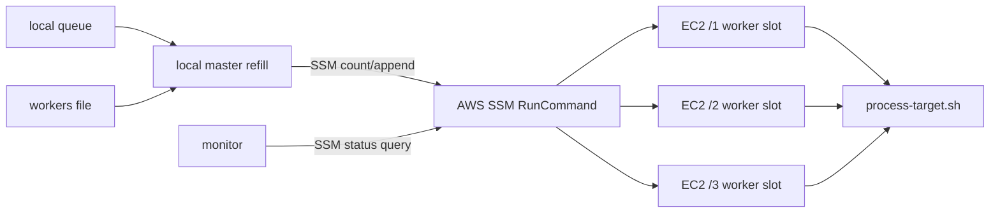

# EC2 Master/Worker Process Queue 운영 가이드

이 문서는 많은 독립 target을 EC2 여러 대에 분산 실행하는 범용 master/worker 큐 패턴을 설명한다. target은 한 줄짜리 record이며 plain line, TSV, NDJSON 모두 가능하다.

## 구조



## 파일

| 파일 | 의미 |
| --- | --- |
| `target_process.queue` | 아직 EC2에 dispatch되지 않은 local queue |
| `target_process.dispatched` | EC2 remote queue로 넘긴 audit log |
| `process-workers.instances` | EC2 instance id 목록 |
| `workers` | `instance-id remote-dir` 형식의 worker slot 목록 |
| `/N/next` | remote worker slot 대기 queue |
| `/N/completed` | 성공 target 누적 |
| `/N/failed` | 실패 target 누적 |
| `/N/status` | 현재 상태 한 줄 |
| `/N/logs/worker.log` | worker 로그 |

## Monitor 출력

`monitor-process-workers.sh`는 worker slot 상태와 함께 인스턴스 단위 리소스 지표를 보여준다.

| 컬럼 | 의미 |
| --- | --- |
| `NEXT` | 아직 실행 전인 remote 대기 target 수 |
| `COMPLETED` | slot별 성공 누적 수 |
| `FAILED` | slot별 실패 누적 수 |
| `CPU` | 인스턴스 단위 CPU 사용률 |
| `RX/s` | loopback 제외 전체 NIC receive rate |
| `TX/s` | loopback 제외 전체 NIC transmit rate |
| `STATUS` | slot별 현재 상태 한 줄 |

`CPU`, `RX/s`, `TX/s`는 slot별 값이 아니라 인스턴스별 값이다. 같은 EC2의 `/1`, `/2`, `/3` 행에는 동일한 값이 반복 표시된다.

## 반드시 챙길 것

### Queue Lock

- local queue pop은 `flock "$QUEUE_FILE.lock"`으로 보호한다.
- worker의 remote `next` pop은 slot별 `next.lock`으로 보호한다.
- master의 remote `next` append도 같은 `next.lock`으로 보호한다.
- lock 없이 `head`, `tail`, `mv`, `cat >> next`를 섞으면 target이 중복되거나 사라질 수 있다.

### Atomic Write

- `status`는 고유 임시 파일에 쓰고 `mv -f`로 교체한다.
- `status.$$`처럼 PID 기반 고정 파일명은 background monitor/main process race를 만들 수 있다.
- 권장:

```bash
tmp="$(mktemp "${status_file}.XXXXXX")"
printf "%s\n" "$(date -Is) phase=running target=$target" > "$tmp"
mv -f "$tmp" "$status_file"
```

### Target Record

- record 하나는 반드시 한 줄이어야 한다.
- TSV/NDJSON 내부에 literal newline을 넣지 않는다.
- shell에서는 record를 항상 quote한다.
- secret은 queue/status/log/command line에 넣지 않는다.

### Monitor Semantics

- `NEXT`는 아직 시작하지 않은 remote 대기 target 수다.
- active/current target은 `NEXT`에 포함되지 않는다.
- `failed`는 누적 기록이다. retry 성공 후에도 줄 수가 자동 감소하지 않는다.

### Instance Termination

- EC2는 해당 인스턴스의 모든 slot이 `NEXT=0`이고 `phase=idle`일 때만 종료한다.
- 일부 slot만 idle이면 종료하지 않는다.
- 오래된 `running`, `committing` 상태는 실제 프로세스나 결과 검증 없이 종료하지 않는다.
- 종료 후 `process-workers.instances`와 `workers`에서 instance-id를 제거한다.

### Rebalance

- local queue가 비었는데 heavy target이 일부 remote `next`에 몰릴 수 있다.
- 현재 실행 중인 target은 건드리지 않는다.
- master를 멈추고 remote `next`만 `flock`으로 drain한 뒤 idle slot에 round-robin append한다.
- drain/assignment 결과 파일을 남긴다.

## Queue Record 예시

Plain:

```text
target-001
target-002
```

TSV:

```tsv
target-001	tenant-a	2026-04-01	{"priority":"high"}
target-002	tenant-b	2026-04-02	{"priority":"normal"}
```

NDJSON:

```jsonl
{"id":"target-001","tenant":"tenant-a","date":"2026-04-01","priority":"high"}
{"id":"target-002","tenant":"tenant-b","date":"2026-04-02","priority":"normal"}
```

## 운영 순서

0. `skills/ec2-process-queue/scripts/` 내부 파일은 템플릿 원본이다. 구체 작업에서 직접 수정하거나 직접 실행하지 않는다.
1. 템플릿 스크립트를 작업용 디렉토리로 복사한다.
2. 복사본 `process-target.sh`에 target 하나 처리 로직을 구현한다.
3. `target_process.queue`를 만든다.
4. EC2를 생성한다.
5. `process-workers.instances`를 작성한다.
6. `workers`를 생성한다.
7. SSM Online을 확인한다.
8. 복사본 scripts를 S3 임시 위치에 올리고 EC2 slot에 배포한다.
9. worker를 시작하고 모두 `idle`인지 확인한다.
10. 복사본 master refill을 foreground로 실행한다.
11. 별도 터미널에서 복사본 monitor를 실행한다.
12. local queue가 0이어도 remote `next`와 active target이 남을 수 있으므로 계속 monitor한다.
13. 실패 target을 수집하고 retry한다.
14. 완전히 idle인 EC2만 순차 종료한다.

권장 작업 디렉토리 예:

```bash
mkdir -p process-queue-run/scripts
cp skills/ec2-process-queue/scripts/*.sh process-queue-run/scripts/
chmod +x process-queue-run/scripts/*.sh
```

수정 대상:

```text
process-queue-run/scripts/process-target.sh
```

필요할 때만 수정:

```text
process-queue-run/scripts/process-worker.sh
process-queue-run/scripts/process-master-refill.sh
process-queue-run/scripts/monitor-process-workers.sh
process-queue-run/scripts/ec2-bootstrap-process-workers.sh
```

## 실행 예시

Generate workers:

```bash
: > workers
while read -r id; do
  printf '%s /1\n%s /2\n%s /3\n' "$id" "$id" "$id" >> workers
done < process-workers.instances
```

Run master:

```bash
WORKERS_FILE=workers \
QUEUE_FILE=target_process.queue \
MAX_NEXT=5 \
REFILL_PARALLELISM=10 \
INTERVAL_SECONDS=10 \
process-queue-run/scripts/process-master-refill.sh
```

Monitor:

```bash
watch -n 5 'WORKERS_FILE=workers process-queue-run/scripts/monitor-process-workers.sh'
```

## Failure Analysis

Collect failed:

```bash
aws ssm send-command \
  --region "$AWS_REGION" \
  --instance-ids $(tr '\n' ' ' < process-workers.instances) \
  --document-name AWS-RunShellScript \
  --comment collect-process-failures \
  --parameters commands='[
    "set -euo pipefail",
    "for d in /1 /2 /3; do echo \"###DIR $d\"; [ -s \"$d/failed\" ] && { echo \"--- failed ---\"; cat \"$d/failed\"; echo \"--- log tail ---\"; tail -n 100 \"$d/logs/worker.log\"; }; done"
  ]' \
  --query 'Command.CommandId' \
  --output text
```

Retry by appending selected records to idle or least-loaded remote `next` under `next.lock`.
